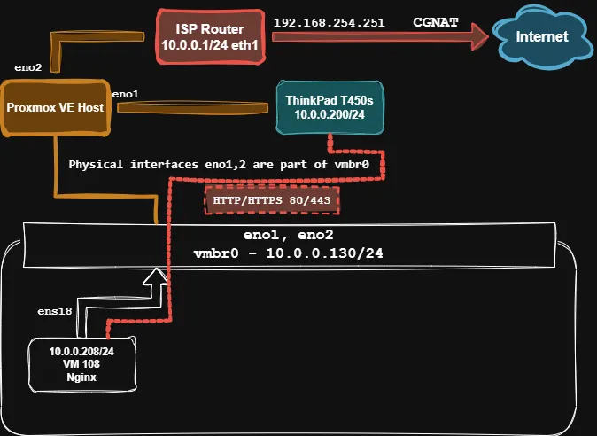

<div align="center">

# Nginx VM Setup on Proxmox VE


This project documents the process of setting up an Nginx web server on a Debian 12 Virtual Machine (VM) hosted in a Proxmox VE environment. The primary goal is to demonstrate and learn about network configuration, basic server hardening, and automation using Bash scripting.

The VM is intended to host a static website, in this case, [Staszic360]([https://github.com/andreansx/Staszic360]) - a virtual tour of my high school.

</div>

## Table of Contents

1.  [Project Goal](#project-goal)
2.  [Target Configuration](#target-configuration)
3.  [Network Diagram](#network-diagram)
4.  [Technologies Used](#technologies-used)
5.  [Prerequisites](#prerequisites)
6.  [Setup Steps](#setup-steps)
    *   [Proxmox VE Preparation](#proxmox-ve-preparation)
    *   [VM Creation & OS Installation](#vm-creation--os-installation)
    *   [Initial VM Configuration](#initial-vm-configuration)
    *   [Static IP Configuration](#static-ip-configuration)
    *   [Firewall (UFW) Setup](#firewall-ufw-setup)
    *   [Nginx Installation & Configuration](#nginx-installation--configuration)
    *   [Deploying the Static Site (Staszic360)](#deploying-the-static-site-staszic360)
7.  [Automation Scripts](#automation-scripts)
## Project Goal

*   To build and configure an Nginx web server on a Debian 12 VM within Proxmox VE.
*   To understand and practically apply network configurations for a VM (static IP, firewall rules).
*   To host the "Staszic360" static website project on this server.
*   To document the entire process as an educational resource and portfolio piece, emphasizing networking and automation.

## Target Configuration

*   **Proxmox VE Host:** Dell PowerEdge R710 with at least two network interfaces (`eno1`, `eno2`).
    *   IP Address (on `vmbr0`): `10.0.0.130/24`
*   **VM (ID 108):** Debian 12 (Minimal installation + SSH Server)
    *   Static IP Address: `10.0.0.208/24`
    *   Gateway: `10.0.0.1` (ISP Router)
    *   DNS: [e.g., `8.8.8.8`, `1.1.1.1`]
    *   Services: Nginx, SSH
*   **Networking:**
    *   Proxmox bridge `vmbr0` utilizing physical host interfaces `eno1` and `eno2`.
    *   `eno1` connected to a client machine (ThinkPad T450s at `10.0.0.200/24`) for direct access and testing.
    *   `eno2` connected to the ISP Router (`10.0.0.1/24`).
    *   The Proxmox host effectively acts as a switch for the client machine.
    *   Internet access is behind CGNAT (WAN IP of router: `192.168.254.251`).

## Network Diagram

<div align="center">


*Detailed diagram illustrating the lab setup.*

</div>

## Technologies Used

*   **Virtualization:** Proxmox VE 8.4.1
*   **VM Operating System:** Debian 12 "Bookworm"
*   **Web Server:** Nginx
*   **Firewall:** UFW (Uncomplicated Firewall)
*   **Scripting:** Bash
*   **Client OS (for testing):** Windows 11 on ThinkPad T450s

## Prerequisites

*   A working Proxmox VE installation.
*   Debian 12 Netinstall ISO image.
*   Basic knowledge of Linux command line and networking concepts.
*   Access to your ISP router for network information (gateway IP).
*   Files for the Staszic360 project (or any static site) ready for deployment.

## Setup Steps

This section outlines the manual steps taken to set up the environment. Some of these steps can be automated using the scripts in the [`scripts/`](./scripts/) directory.

### Proxmox VE Preparation
1.  Ensure Proxmox VE host networking is configured.
2.  Create a Linux Bridge (`vmbr0`) in Proxmox, assigning it a static IP (e.g., `10.0.0.130/24`) and using `eno1` and `eno2` as bridge ports.
    *   `eno1` will be connected to the ThinkPad.
    *   `eno2` will be connected to the ISP Router.

### VM Creation & OS Installation
1.  Create a new VM in Proxmox (e.g., VM ID 108).
    *   **OS:** Debian 12 (from ISO).
    *   **System:** Default.
    *   **Disks:** At least [e.g., 10GB] storage.
    *   **CPU:** At least [e.g., 1 core].
    *   **Memory:** At least [e.g., 512MB-1GB] RAM.
    *   **Network:** Bridge `vmbr0`, Model `VirtIO (paravirtualized)`.
2.  Install Debian 12. During installation:
    *   Select a minimal install.
    *   Ensure "SSH server" is selected in the software selection task. Deselect "Web server" for now if you plan to use the Nginx setup script or install it manually as per below.

### Initial VM Configuration
1.  Log in to the VM via SSH: `ssh your_user@VM_IP_ADDRESS` (initially, this might be a DHCP address).
2.  Update the system:
    ```bash
    sudo apt update && sudo apt upgrade -y
    ```
3.  Install essential tools:
    ```bash
    sudo apt install -y curl net-tools ufw vim # or nano
    ```

### Static IP Configuration
Configure a static IP address for the VM. Edit `/etc/network/interfaces`:
```bash
sudo nano /etc/network/interfaces
```
Example configuration (interface name might be `ens18` or similar):
```plaintext
# The loopback network interface
auto lo
iface lo inet loopback

# The primary network interface (e.g., ens18)
auto ens18
iface ens18 inet static
    address 10.0.0.208/24
    gateway 10.0.0.1
    dns-nameservers 8.8.8.8 1.1.1.1 # Replace with your preferred DNS
```
Apply changes: `sudo systemctl restart networking` or `sudo reboot`. Reconnect via SSH using the new static IP.
*See example configuration: [`configs/network/interfaces`](./configs/network/interfaces)*

### Firewall (UFW) Setup
Set up basic firewall rules using UFW.
```bash
sudo ufw default deny incoming
sudo ufw default allow outgoing
sudo ufw allow ssh     # or 22/tcp
sudo ufw allow http    # or 80/tcp
sudo ufw allow https   # or 443/tcp
sudo ufw enable        # Type 'y' and press Enter
sudo ufw status verbose
```
Alternatively, use the automation script: `sudo ./scripts/setup-ufw.sh`.
*See example UFW status: [`configs/ufw/ufw-rules.txt`](./configs/ufw/ufw-rules.txt)*

### Nginx Installation & Configuration
1.  Install Nginx:
    ```bash
    sudo apt install nginx -y
    sudo systemctl start nginx
    sudo systemctl enable nginx
    ```
2.  Prepare the document root for Staszic360:
    ```bash
    sudo mkdir -p /var/www/staszic360
    ```
3.  Create an Nginx server block configuration for Staszic360. Create a new file:
    ```bash
    sudo nano /etc/nginx/sites-available/staszic360
    ```
    Example content:
    ```nginx
    server {
        listen 80;
        listen [::]:80;

        server_name 10.0.0.208; # Or your_domain.com

        root /var/www/staszic360;
        index index.html index.htm;

        location / {
            try_files $uri $uri/ =404;
        }
    }
    ```
4.  Enable the site and test configuration:
    ```bash
    sudo ln -s /etc/nginx/sites-available/staszic360 /etc/nginx/sites-enabled/
    sudo rm /etc/nginx/sites-enabled/default # Optional: remove default Nginx site
    sudo nginx -t
    sudo systemctl reload nginx
    ```
*See example Nginx configuration: [`configs/nginx/staszic360`](./configs/nginx/staszic360)*

### Deploying the Static Site (Staszic360)
1.  Copy your static site files (e.g., Staszic360 project) to `/var/www/staszic360/` on the VM. You can use `scp`:
    ```bash
    # From your local machine, inside your Staszic360 project directory:
    scp -r ./* your_user@10.0.0.208:/var/www/staszic360/
    ```
2.  Set correct permissions on the server:
    ```bash
    sudo chown -R www-data:www-data /var/www/staszic360
    sudo find /var/www/staszic360 -type d -exec chmod 755 {} \;
    sudo find /var/www/staszic360 -type f -exec chmod 644 {} \;
    ```

<div align="center">
<h2>Automation Scripts</h2>
</div>

This project includes Bash scripts to automate parts of the setup process. They are located in the [`scripts/`](./scripts/) directory. Remember to make them executable (`chmod +x script_name.sh`) and run them with `sudo` if required.

*   **[`setup-ufw.sh`](./scripts/setup-ufw.sh):** A script for quick setup of Uncomplicated Firewall (UFW) rules (SSH, HTTP, HTTPS).
    ```bash
    sudo ./scripts/setup-ufw.sh
    ```
*   **(Future Script Idea) `setup-nginx.sh`:** A script to install Nginx, create a document root, and set up a basic server block.
*   **(Future Script Idea) `basic-harden.sh`:** A script for basic server hardening tasks (e.g., installing Fail2ban).

## Testing

1.  **From the ThinkPad T450s (Client):** Open a web browser and navigate to `http://10.0.0.208`.
2.  The Staszic360 website (or your deployed static site) should load.
    *See an example screenshot: [`docs/screenshots/staszic360-working.png`](./docs/screenshots/staszic360-working.png)*


<div align="center">
Made with ❤️ and a lot of learning!
</div>
