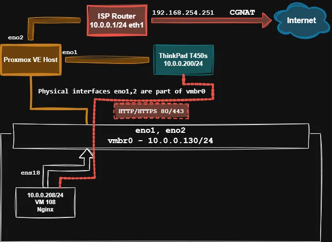

# Nginx VM Setup

## Intended configuration

## Network Diagram
  

## Used technologies

* **Nginx Web server**
* **Bash scripting**

<h2>Automation</h2>

**[setup-ufw.sh](./scripts/setup-ufw.sh)** - A bash script for quick setup of **Uncomplicated Firewall** security on the VM.
